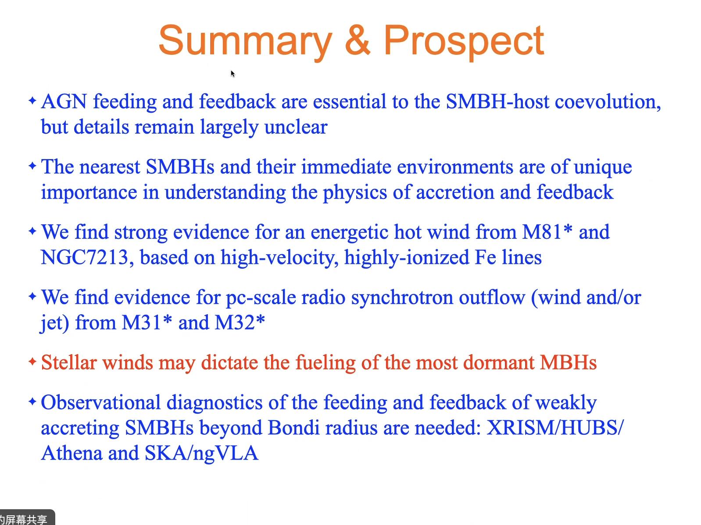
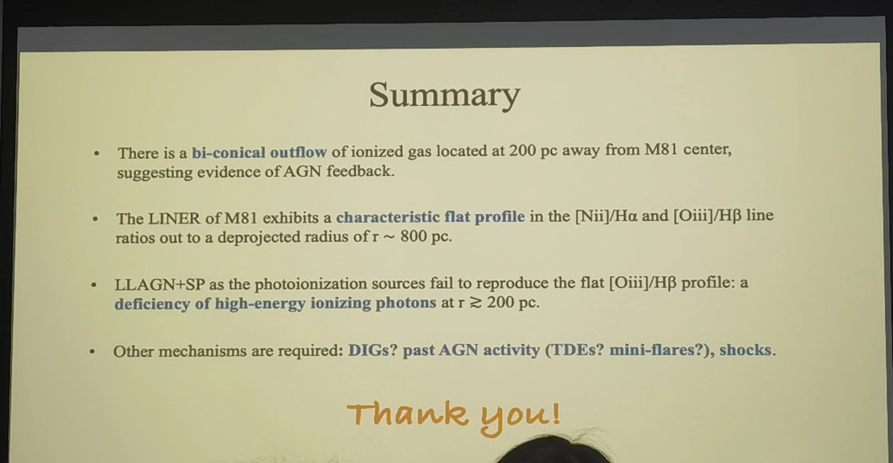

#### Feeding & Feedback of Low-luminosity AGN
Reporter: 李志远

 
Figure2 - xxx & Best 2014

Figure 6 focus on:
the morphology can infer the existence of jet or wind
the spectral index can related to optical-thin and the radiative mechanism

#### masafusa (Peking Uni.) 23.10.27
M signature

#### Zongnan Li (NAOC) 240105
M81

#### Norbert Werner (MUNI) 2024.05.23
Title: Accreting massive black holes and a Czech UV space telescope
Q: Why so much gas and so few stars?

