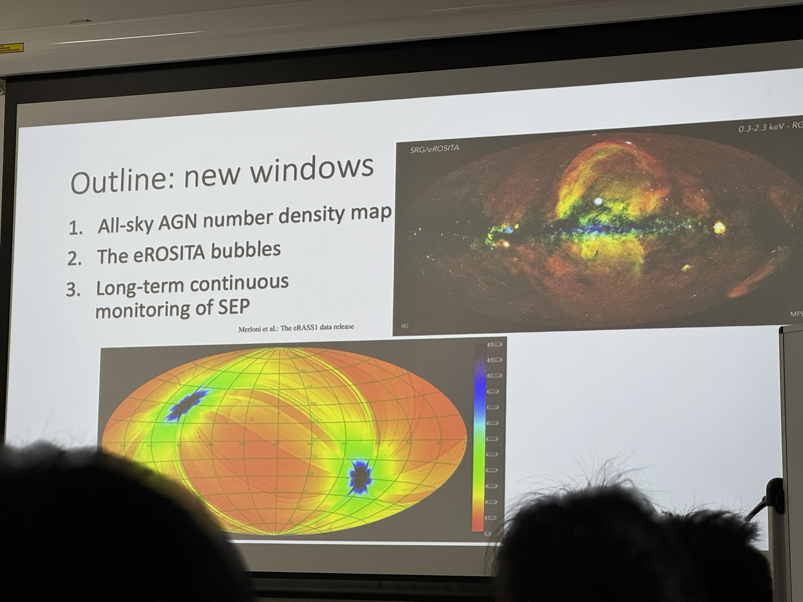

#### Norbert Werner (MUNI) 2024.05.23
Title: Accreting massive black holes and a Czech UV space telescope
The QUVIK satellite
kilonovae

#### Teng Liu 刘腾 (USTC)
New windows in X-ray astronomy opened by eROSITA all-sky surveys

XMM: 25 deg^2 continuum field

eROSITA:
4 hours to scan a great circle, and 6 months to cover the full sky.
FOV has a diameter of 1.03 deg.

The critical factors to see dipole structure: 
1.accurate treatment of bias, uncertainty
2.remove comtamination
3.full-sky data

Is eROSITA bubble a single structure or not?
polarized radio arcs connecting NPS and LPC

LPC: lotus petal cloud
SEP: South Ecliptic Pole