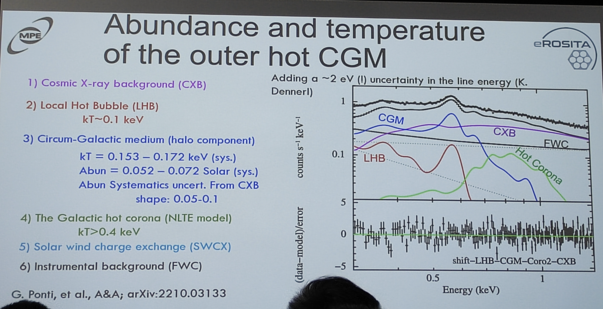
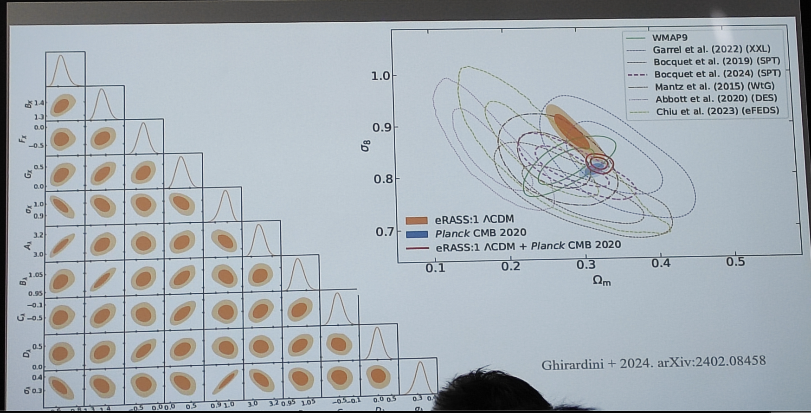
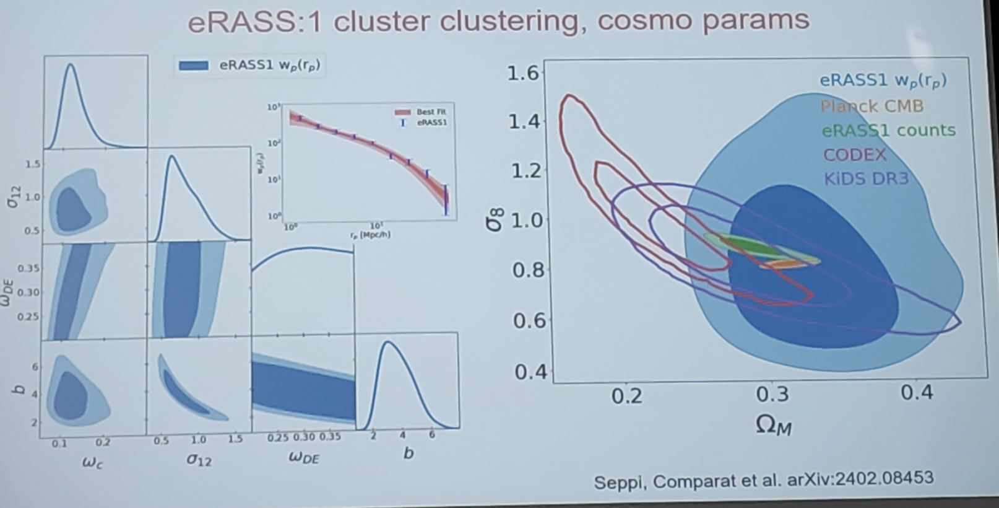

#### Comparat, Johan (MPE) 240415
Topic: X-ray emissions from the large scale structure  of the Universe with an eROSITA focus

<!-- ---
prev: 
    text: "text to show"
    link: "/Colloquium/2024/2024-04-11-The-impact-of-massive-stars-and-black-holes-on-the-dynamical-evolution-of-star-clusters"
next: false
--- -->

* CGM

<figure style="text-align: center;">
  
  <figcaption>
    Galaxies and hot CGM
  </figcaption>
</figure>

* eROSITA bubbles

Such a kind of bubbles are also found in Milky-Way like galaxies in TNG simulation.

<figure style="text-align: center;">
  
  <figcaption>
    Fig.1: eROSITA bubbles
  </figcaption>
</figure>

* Star-forming and quiscent galaxies

<figure style="text-align: center;">
  
  <figcaption>

  </figcaption>
</figure>

* Baryon fraction inference

<figure style="text-align: center;">
  
  <figcaption>

  </figcaption>
</figure>

* Stack galaxies and boost of satellite galaxies

<figure style="text-align: center;">
  
  <figcaption>

  </figcaption>
</figure>

* Abundance and temperature of the outer skirts of hot CGM

<figure style="text-align: center;">
  
  <figcaption>

 

  </figcaption>
</figure>

* Clusters and groups

* Constraints on cosmological parameters

<figure style="text-align: center;">
  
  <figcaption>

  </figcaption>
</figure>

<figure style="text-align: center;">
  
  <figcaption>

  </figcaption>
</figure>

* Conclusion

<figure style="text-align: center;">
  
  <figcaption>

  </figcaption>
</figure>