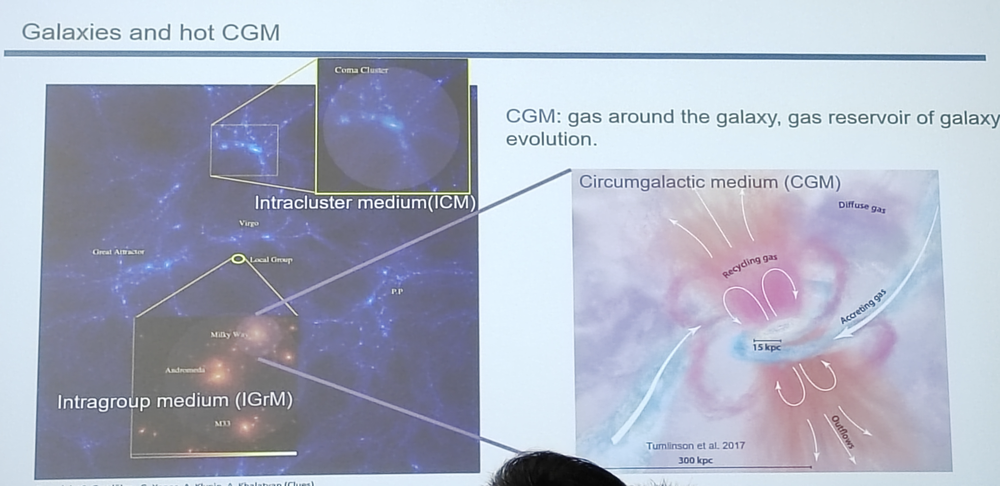
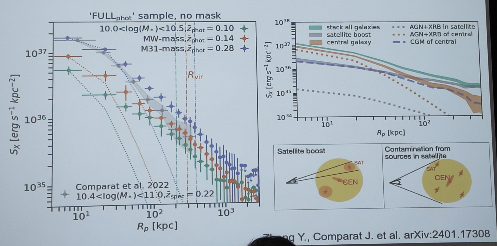

#### Ping Chen (Weizmann) 23.11.10
Type 1c SN
Ni(ckel)56 - the first peak
CSM(circlestellar medium) - the second peak
H and Helium absorption line - different types of SN

#### Mike Belvedersky(Space Research Institute (Moscow, Russia)) 23.11.17
Lockman Hole field is an area in the sky with an extremely low column density of neutral hydrogen on the line of sight (Lockman et al., 1986).

quality estimation

#### Xiaoyuan Zhang  张啸远 (Max Planck Institute for Extraterrestrial Physics) 23.11.17
Abstract:
The highly ionized warm/hot intergalactic medium (WHIM) permeating the vast space of the cosmic filaments is one of the least explored baryon contents in the local Universe. The properties of the WHIM in long cosmic filaments with lengths reaching up to 20-100Mpc, which account for >80% of the total filament volume and 50% of the baryonic mass, remain to be explored. In this work, we examine the emission properties of the WHIM in long cosmic filaments using the deepest SRG/eROSITA All-Sky Survey data available. By stacking the X-ray emission from 8000 cosmic filaments traced by the galaxy distribution by the SDSS, we detect the X-ray emission in the filament. After correcting for the emission from the unresolved point sources and extended low-mass haloes, the detection of the WHIM component remains statistically significant. We further stack the eROSITA X-ray spectra and obtain the first-ever broadband 100 eV resolution spectrum of cosmic filaments at the source frame. The best-fit mean gas temperature of the WHIM component is 10^6.8 K.

#### Lei Sun (UCAS) 231201

#### Comparat, Johan (MPE) 240415
Topic: X-ray emissions from the large scale structure  of the Universe with an eROSITA focus

<!-- ---
prev: 
    text: "text to show"
    link: "/Colloquium/2024/2024-04-11-The-impact-of-massive-stars-and-black-holes-on-the-dynamical-evolution-of-star-clusters"
next: false
--- -->

* CGM

<figure style="text-align: center;">
  
  <figcaption>
    Galaxies and hot CGM
  </figcaption>
</figure>

* eROSITA bubbles

Such a kind of bubbles are also found in Milky-Way like galaxies in TNG simulation.

<figure style="text-align: center;">
  
  <figcaption>
    Fig.1: eROSITA bubbles
  </figcaption>
</figure>

* Star-forming and quiscent galaxies

<figure style="text-align: center;">
  
  <figcaption>

  </figcaption>
</figure>

* Baryon fraction inference

<figure style="text-align: center;">
  
  <figcaption>

  </figcaption>
</figure>

* Stack galaxies and boost of satellite galaxies

<figure style="text-align: center;">
  
  <figcaption>

  </figcaption>
</figure>

* Abundance and temperature of the outer skirts of hot CGM

<figure style="text-align: center;">
  
  <figcaption>

 

  </figcaption>
</figure>

* Clusters and groups

* Constraints on cosmological parameters

<figure style="text-align: center;">
  
  <figcaption>

  </figcaption>
</figure>

<figure style="text-align: center;">
  
  <figcaption>

  </figcaption>
</figure>

* Conclusion

<figure style="text-align: center;">
  
  <figcaption>

  </figcaption>
</figure>

#### Sebastiano Cantalupo (unimib) 240418
Illuminating the Cosmic Web and the Circumgalactic Medium with the help of quasars
"low" halo mass with various redshift z -- Ly \alpha
Lyalpha and HeII are similar, which make Lyalpha can trace kinematics. It is once considered untraceable to kinematics.
MUSE traces the largest filaments
4\times 4 MUSE traces the cosmic web
ALMA: large overdensity of CO(4-3)
Chandra: even larger overdensity
JWST & HST: galaxy morphologies, disk companion detected (dusty SF disk), redshift z=3.2

z~3.2, a giant, massive disk galaxy

Lyalpha, Halpha and HeII-Halpha observations require a multiphase CGM with broad density distribution / high turbulence (as "turbulent" as the ISM).
Associated with filamentsw with galaxy / AGN overdensity at z>3.

#### Shen lu 20240604
z from 1 to 3
SFG: star-forming galaxies

shen lu 2024: sSFR-EW(Halpha+NII) log-log relation

inside-out quenching or outside-inter forming?