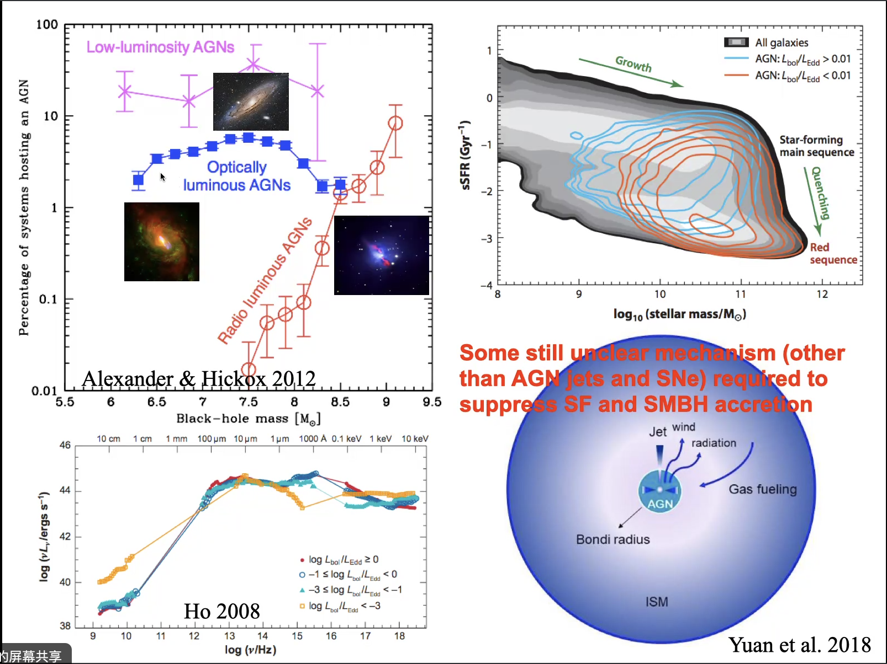

#### Feeding & Feedback of Low-luminosity AGN
Reporter: 李志远

 
Figure2 - xxx & Best 2014

Figure 6 focus on:
the morphology can infer the existence of jet or wind
the spectral index can related to optical-thin and the radiative mechanism
