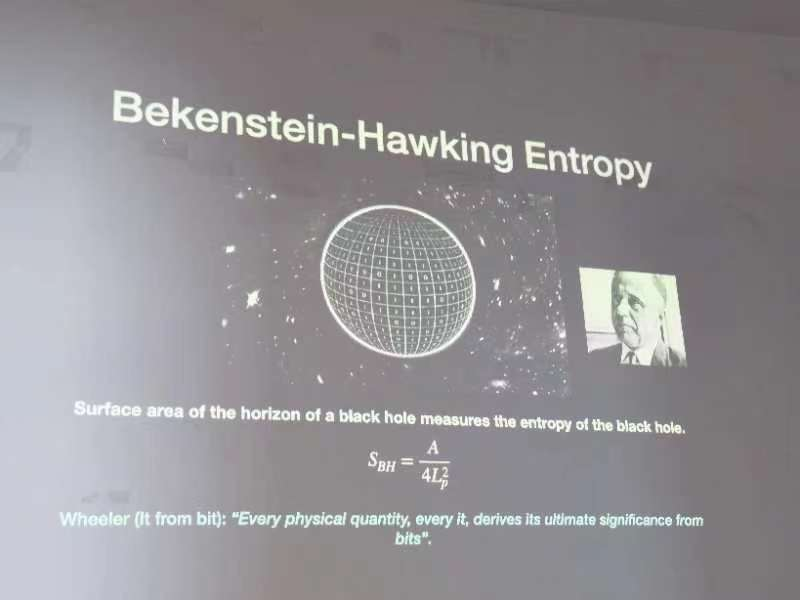
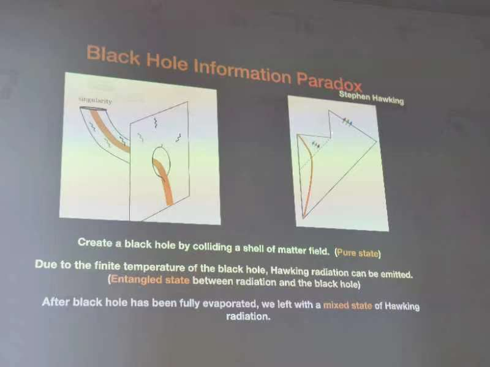
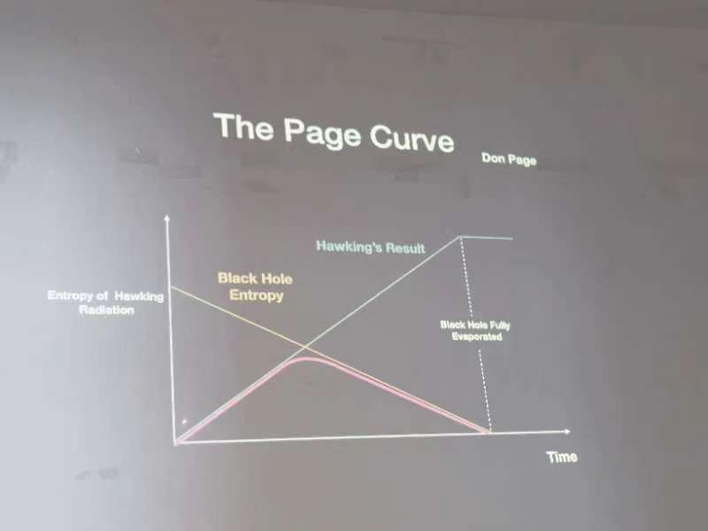

杨镇斌 2023.11.23
Title: Recent progress in black hole information problem
Abstract: I will review the black hole information paradox and discuss recent progress in addressing this problem using wormholes. 

几何对应了信息-熵
有能量和温度，推导出热力学熵

从母宇宙中看，子宇宙会带走一些信息，因此母宇宙的信息看似不守恒，这也就是信息悖论
二维代表时间和空间，虚线代表黑洞视界面
量子纠缠会让粒子处在哪个态变得不确定
purity表示是纯态还是混态
纠缠熵：如果是纯态，则S=0
