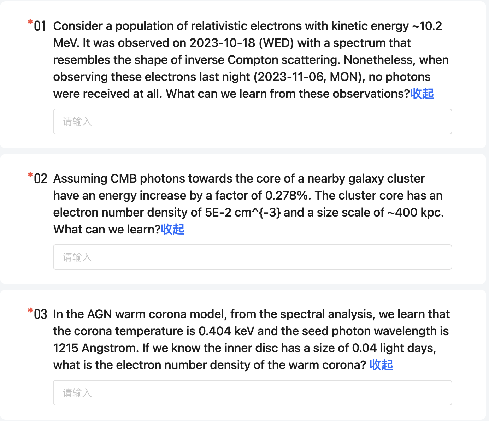
#### Q1
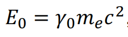
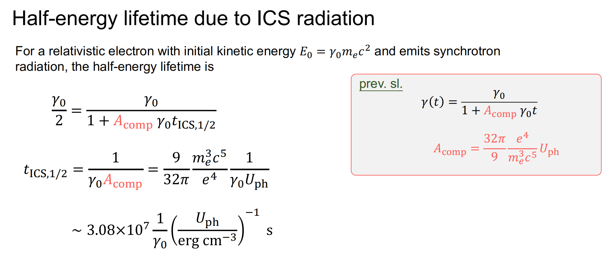
Get Uph limit because the time > t_ICS
#### Q2
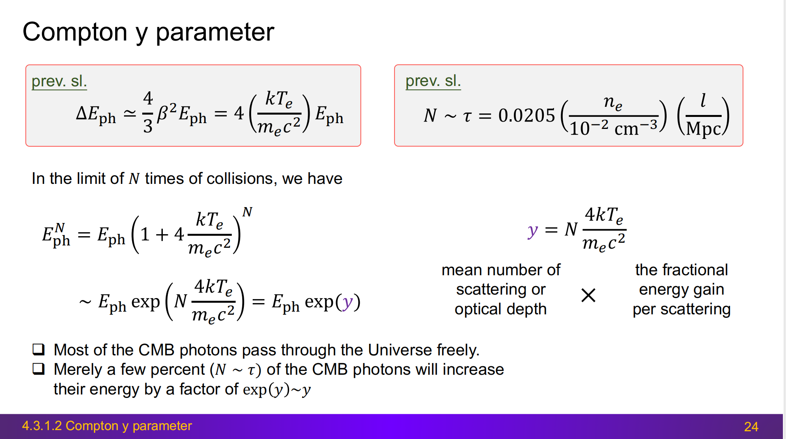
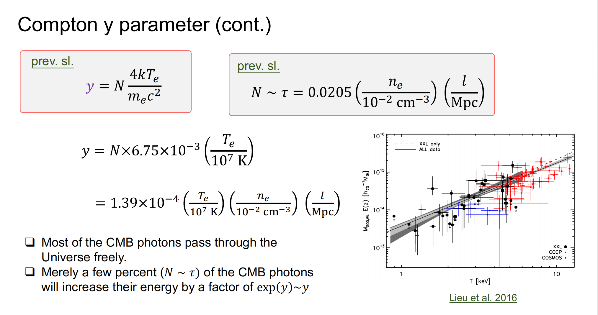
Get Te
#### Q3
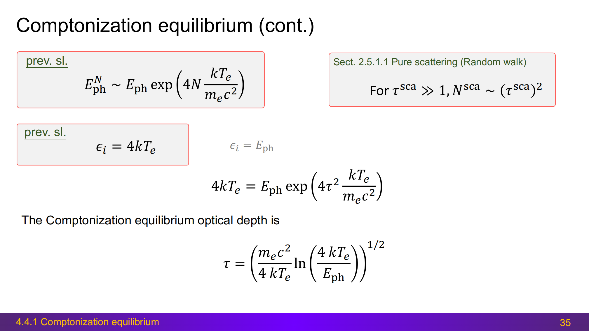
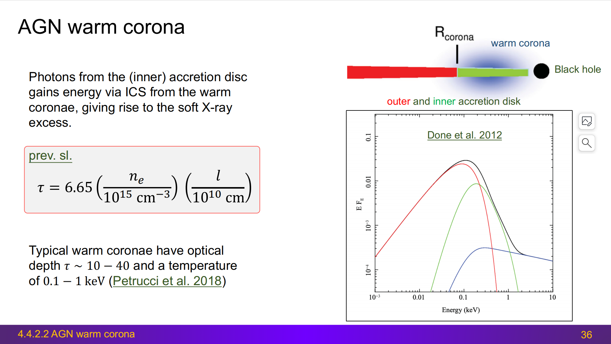
Get ne!
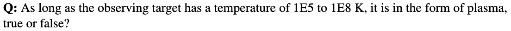
Take attention to the density, e.g, white dwarf

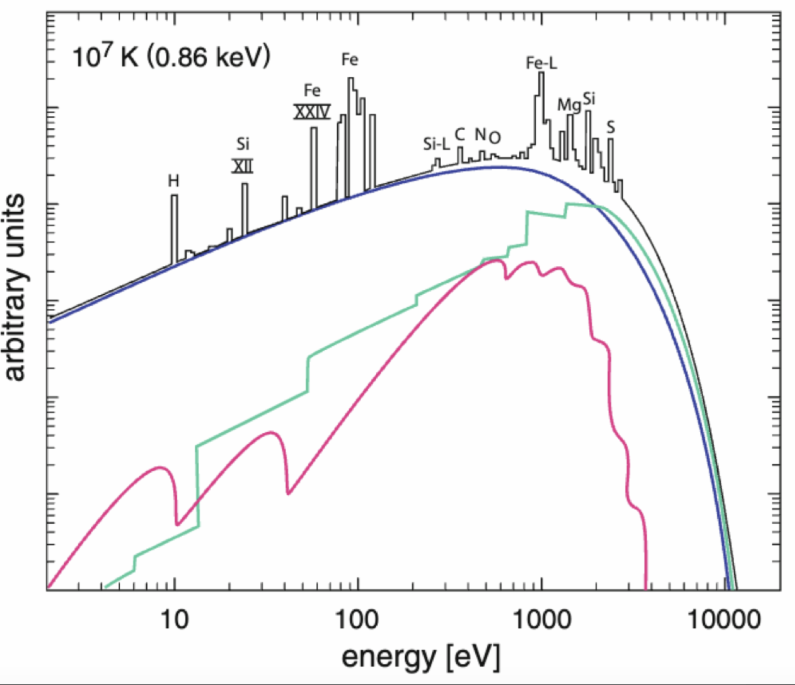
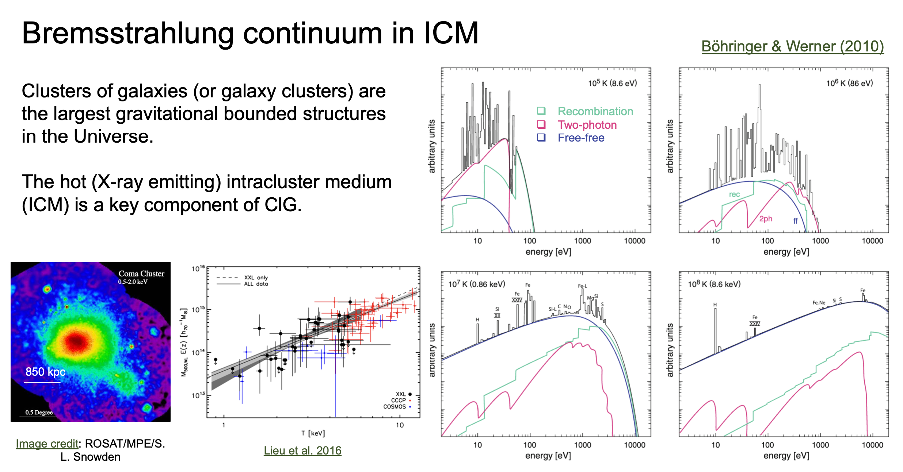
the green line is RRC.
O VIII have ionization energy of 871eV
这个问题是问RRC小于1keV的这个截断是谁的，我一直理解错了。。。
此时O VII看不到了，因为温度高，O VII较难存在，所以数量比较少
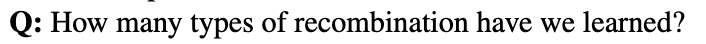
RR(Radiative recombination)，DR(Dielectronic recombination), charge exchange
RR涉及一个电子，DR涉及两个电子
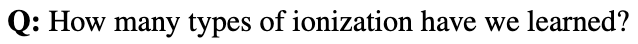
photoionization, collisional ionization, charge exchange, auto-ionization
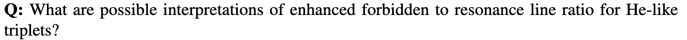
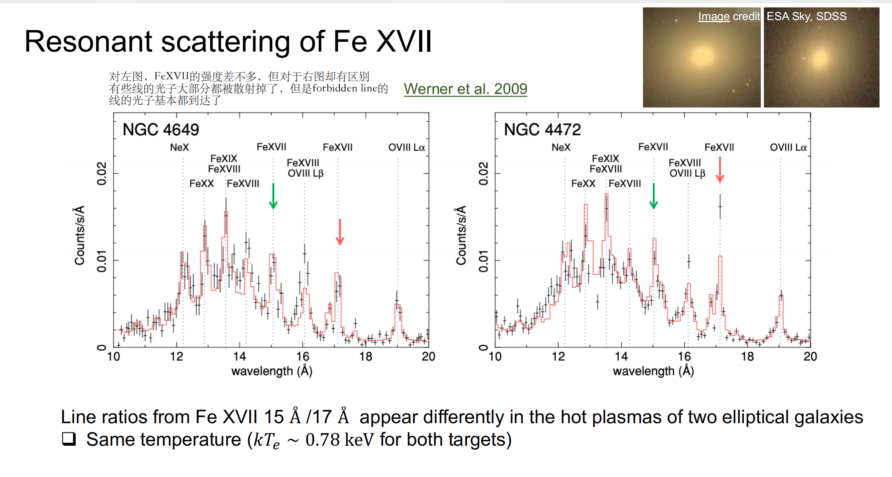
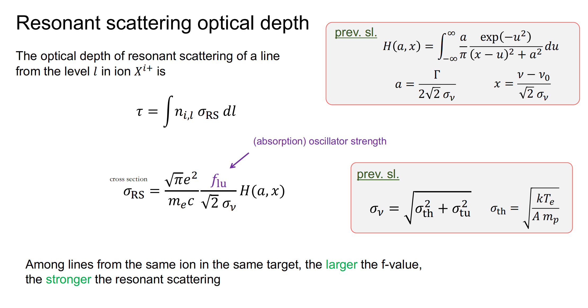
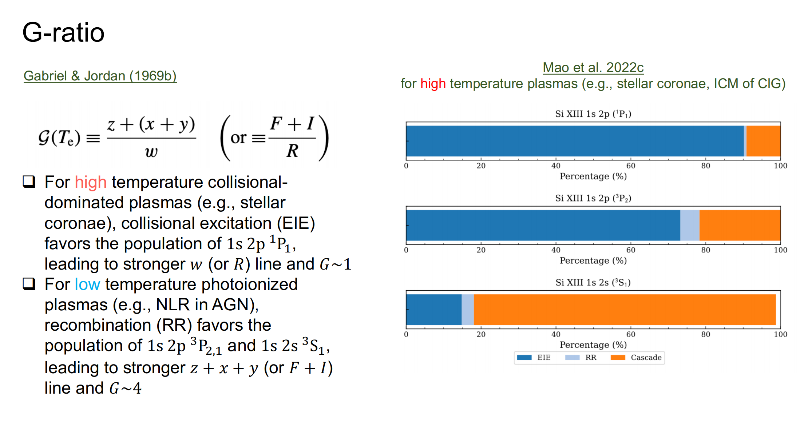
考虑两个方面：cross section和捕获效率
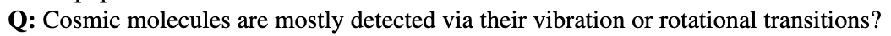

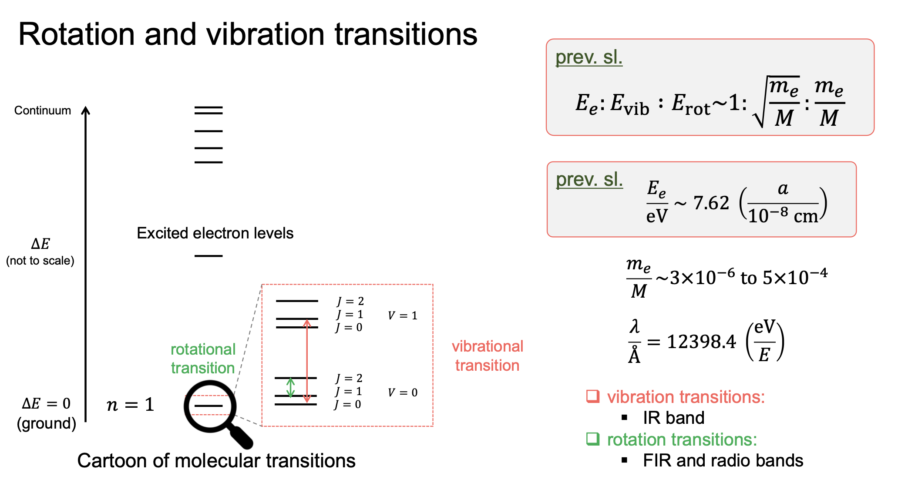