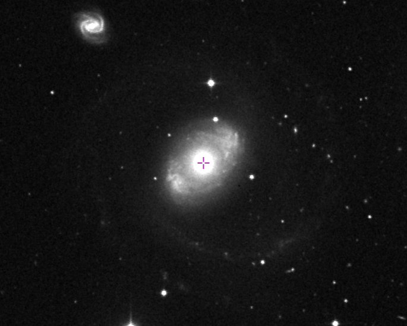
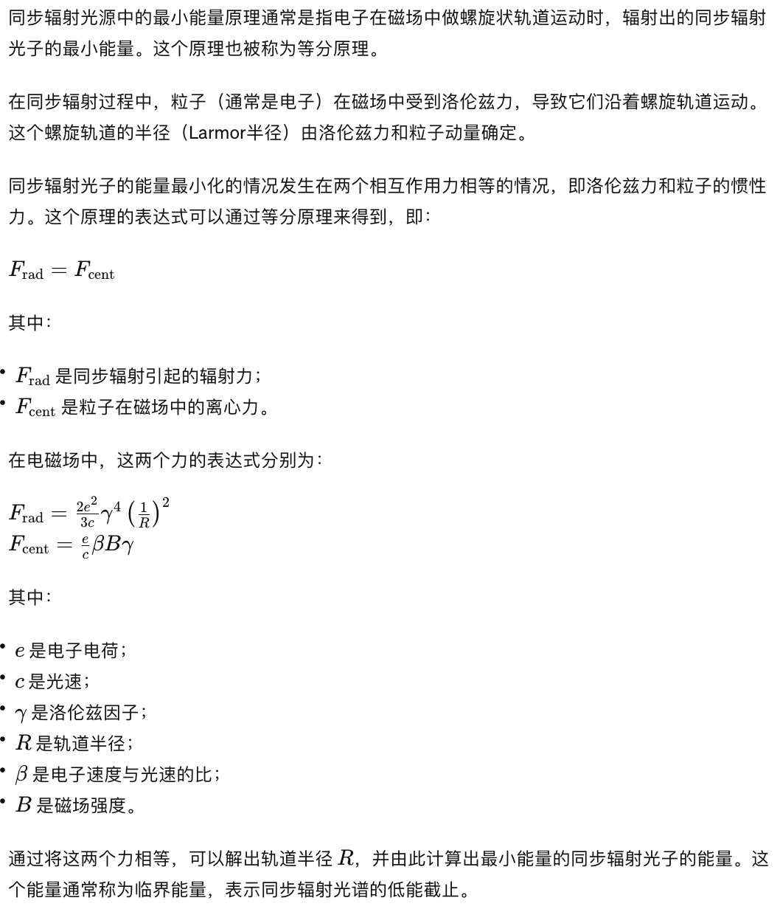
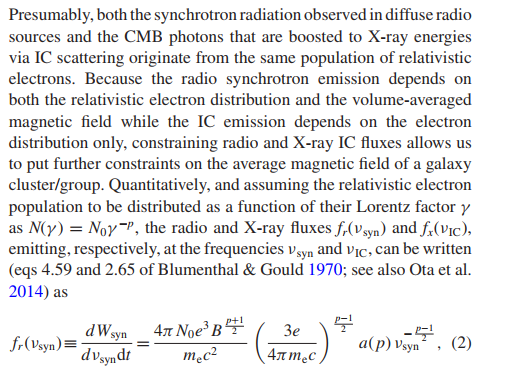
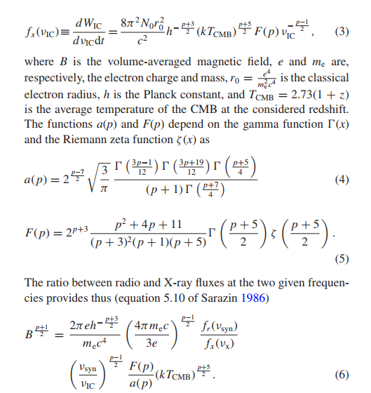
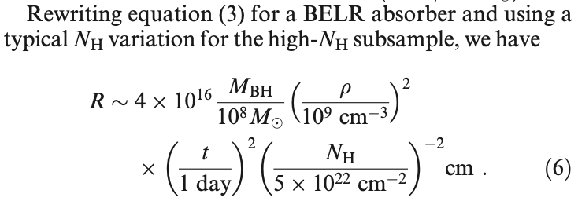
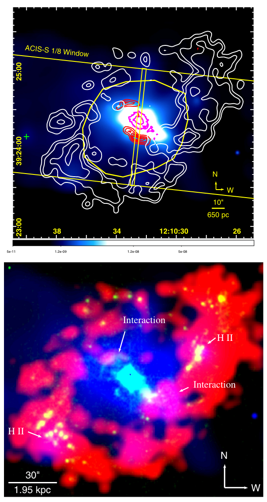
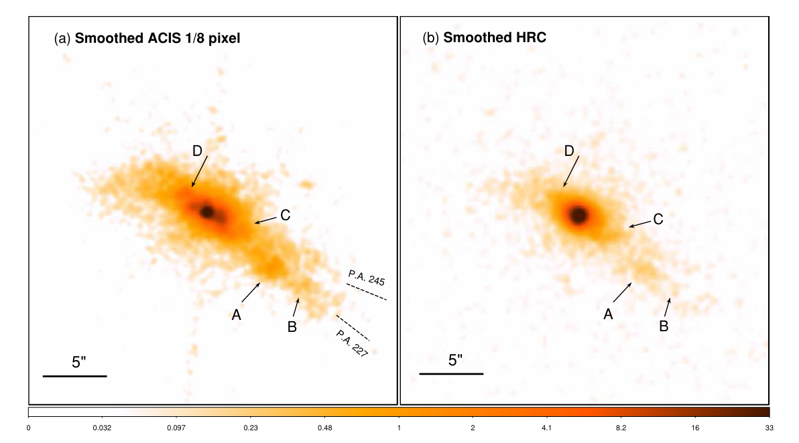
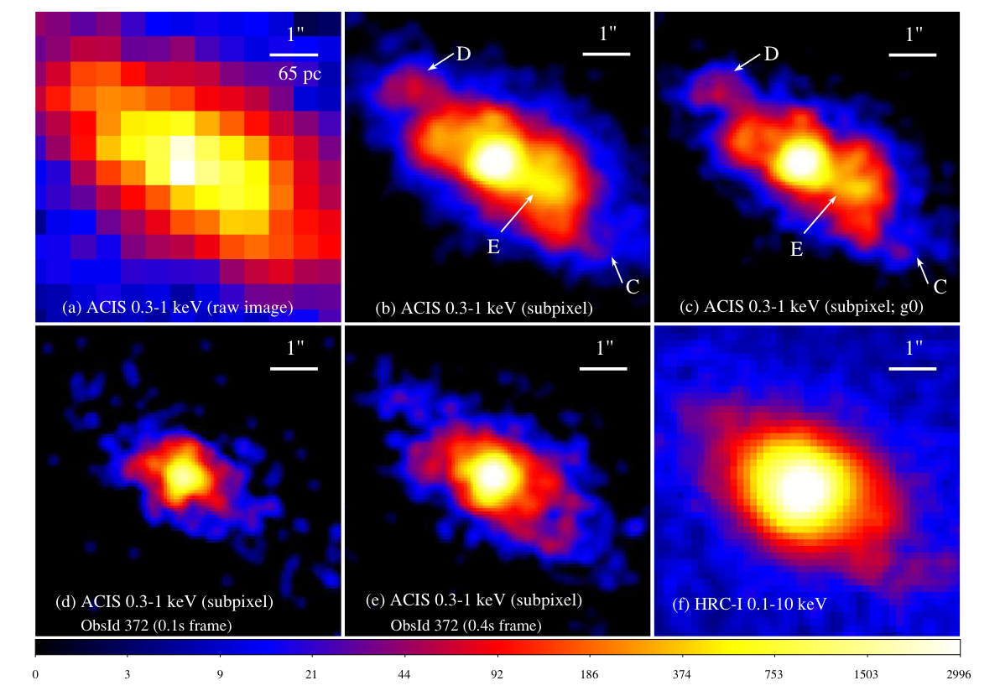
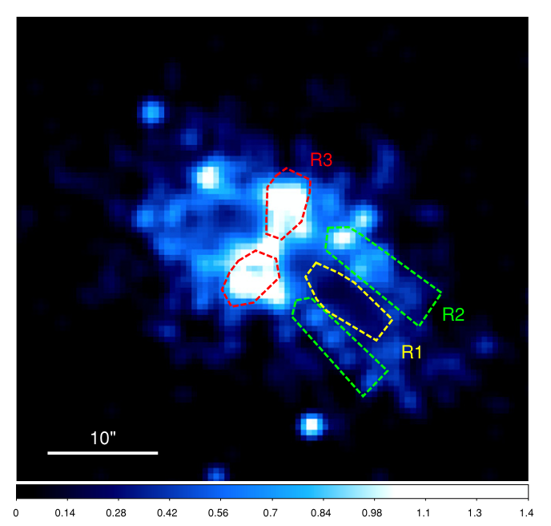
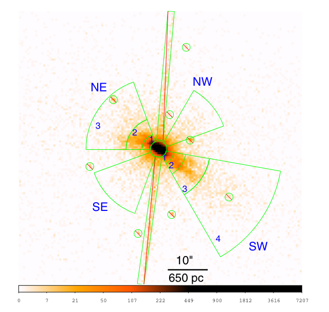

# The meaning of detecting X-ray emission in Seyfert galaxies?
## 一. 为什么研究radio-quiet Seyfert galaxies的X-ray emission?
### 1. Seyfert galaxies有什么特殊之处？
Chatgpt --
Seyfert星系在X射线研究中的受欢迎程度主要源于其相对较亮的X射线辐射、X射线吸收特征、活跃的核心黑洞以及多波段观测的可能性。这使得它们成为研究AGN和宿主星系相互作用的理想天体。
### 2. 为什么要求radio-quiet?
Wang, et al, 2009, ApJ --
Radio-loud的星系中，X-ray emission与强大的射电喷流相对应(counterpart)，可以延伸到kpc甚至是Mpc尺度。在radio-quiet的Seyfert星系中，有与之类似的东西，在窄线区域 (NLR) 尺度上发现的较小喷流。
Me --
Seyfert星系是radio-quiet的。所以这两个问题好像是同一个。。因为想研究radio-quiet的AGN，所以选择了Seyfert星系，这也是一个理由。
Wang, et al, 2011, ApJ, II of series --
关于射电喷流在NLR电离结构中是否与核心光电离发挥竞争作用一直存在激烈的讨论。
Me --
天文中有许多值得研究的有趣现象，只是想研究radio-quiet的Seyfert星系中的这一有趣现象，仅此而已也足够了吧
### 3. 其X-ray emission反映了什么？
#### * 什么东西产生了X-ray emission？
Bianchi, et al, 2006, A&A --
对源的光谱分析表明，soft X-ray emission最可能的来源是the gas photoionized by nuclear continuum。 最清晰的证据来自 Mrk 3 的 190 ks 组合 RGS 光谱，它显然是在photoionized gas中产生的，其中共振散射(resonant scattering)起到了重要作用。
#### * 这种东西对于研究AGN有什么意义？
Wang, et al, 2009, ApJ --
利用高分辨率成像研究这些喷流和排放线气体，为了解向中央引擎提供燃料的星际介质（ISM）以及活动星系核与主星系之间的相互作用提供了有价值的探针。
Me --
感觉还是没连起来，soft X-ray emission的存在只能(possible)说明这里应该有一团气体，由于中心向外发射的光子，被光致电离了，从而产生了X-ray emission。。这难道就是中心AGN对星系的作用吗？传说中的AGN反馈？
## 二. 为什么选择NGC 4151？
### 1. NGC 4151有什么特色？
Wang, et al, 2009, ApJ --
* 被认为是最近的典型Seyfert 1星系；
* 有线性射电喷流，～3.5''（～230pc）；
* 有双锥的NLR，沿NE（东北方向）和SW（西南方向）延展，～10''；
* 射电喷流与NLR的方向不同；
* HST观测到块状的ionized gas (比如[O III]$\lambda$5007A, 沿双锥线流出，延伸至距AGN约1kpc处，Wang, et al, 2011, ApJ, I of series)；
* Chandra ACIS iamges观测到延展的soft X-ray emission (～10'', Wang, et al, 2010, ApJL)，与r>1.5''处的光学禁线发射密切相关；

Wang, et al, 2010, ApJ --
* Mundell et al, 1999, MNRAS, 304. 481 --
  D ∼ 13.3Mpc for $\rm H_{0} = 75~km~s^{−1}~Mpc^{−1}$；
  Me -- 佐证了“被认为是最近的典型Seyfert 1星系”这一观点。
* Yaqoob et al, 1993, MNRAS; Warwick et al. 1995, MNRAS; Warwick et al, 1996, ApJ --
  2-10keV的光度变化大($\rm \sim2-20\times 10^{42}~erg~s^{-1}$)；
* 硬幂律谱的谱指数在～1.35和～1.7之间变化，与2-10keV的flux有关； Seyfert星系的谱指数标准值在1.8-1.9。
* Holt et al, 1980, ApJ --
  用一个在硬波段符合很好的幂律谱拟合软波段时，会发现有“soft excess (<2keV)”的现象；
* Matsuoka et al. 1986, PASJ; Wang et al. 2001, ApJ; Schurch et al. 2003, MNRAS --
  在6.39±0.07keV处存在清晰的发射线，很像是X-ray continuum照射cold iron产生的Fe K$\alpha$荧光发射线；
Me -- 感觉第三条比较像是特色，毕竟每个天体都会有自己奇怪的一些点，但是第三条感觉像是陈疾（笑），很多星系都出现了这种现象，刚好NGC4151离得近。

Wang, et al, 2010, ApJL --
* 由于对它进行了广泛的电磁波谱观测，因此它为研究活动星系核（AGN）与其宿主星系盘中的星际介质（ISM）之间的相互作用提供了最好的机会。这种相互作用或"反馈"被认为在超大质量黑洞和宿主星系的共同演化过程中起着关键作用（e.g., Silk & Rees 1998）。

Wang, et al, 2011, ApJ, I of series --
* Osterbrock & Koski, 1976, MNRAS --
  apparently brightest, active galaxy (Seyfert 1.5)
* 几乎在所有波段都被研究过了
  Me -- 这就是多波段观测！（笑）
* Pedlar et al. 1992, MNRAS; Evans et al. 1993, ApJ; Asifetal. et al, 1998, A&A; Mundell et al, 1999, MNRAS, 304.481 --
  NGC4151 ENLR光学研究的形态、运动学和线比诊断强烈支持光学双锥中的X-ray radiation和宿主星系盘相交，并对参与正常星系自转的周围气体进行了光电离。
* NLR的Near-infrared (NIR) emission-line mapping表明电离气体紧紧跟随着光学双锥，并延伸到双锥外。比如Pa$\beta$ (Storchi-Bergmann et al. 2009, 2010, MNRAS )
* Fernandez et al, 1999, MNRAS; Storchi-Bergmann et al. 2009, MNRAS --
  中性氢($\rm H_2$)emission分布垂直于光学双锥方向。
  Me -- 那应该和星系的方向比较相近
* Storchi-Bergmann et al, 2010, MNRAS --
  $\rm H_2$ emission可能是由来自 AGN 的 X 射线或与沿大尺度棒的吸积流相关的冲击激发的。
* Dumas et al, 2010, ApJ --
  距核1kpc处有两个明显的CO gas通道(lanes), NIR $\rm H_2$ emission peak的中央处没有冷分子气体。这表明$\rm H_2$ emission可能是由活动星系核光激发的。

Wang, et al, 2011, ApJ, II of series --
* Mundell et al, 2003, ApJ --
  在星系中央100 pc的范围内发现了一个微弱的、高度准直的喷流，是与喷流-气体云相互作用有关的类似冲击的特征。
* Storchi-Bergmann et al, 2009, MNRAS --
  对核区域的近红外发射线图揭示了[Fe ii]发射的增强，表明除了核光电离之外还存在激波加热。

Wang, et al, 2011, ApJ, III of series --
* Bianchi et al, 2006, A&A --
  soft X-ray emission和[O iii] emission之间存在很紧密的空间对应关系在邻近的Seyfert 2 galaxies中似乎很常见，optical和X-ray features来自单一的photoionized medium。
* Ogle et al. 2000, ApJ; Schurch et al. 2004, MNRAS; Armentrout et al. 2007, ApJ --
  Chandra和XMM-Newton的高光谱分辨率光栅观测显示soft X-ray emission是由混合发射线(blended emission lines)和来自碳(carbon)、氧(oxygen)、氖(neon)和氮(nitrogen)的类 He 和类 H 转变的辐射重组连续体 (RRC) 引起的。
  后两篇文献显示，X射线线比诊断和RRC特征的电子温度都支持大部分气体都被AGN光电离了（$T\sim 10^{4}~\rm K$）这一结论。
* Liedahl, 1999 --
  从RRC推断，NGC 4151产生extended X-ray emission的电子温度$T\sim 10^4-10^5~\rm K$。

### 2. 以往观测缺少了什么？为什么需要新观测？
Wang, et al, 2009, ApJ --
* X-ray emission与radio jet之间的关联
	* 先前的ACIS数据存在的问题：pile-up and resolution
  
Wang, et al, 2011, ApJ, III of series --
* 对NGC 4151的光栅研究无法提供每个光谱特征的空间分布情况。提取的光谱既包括核辐射，也包括来自不同物理尺度的扩展辐射。因此，仅根据高分辨率光谱，不能排除光致电离emission可能与靠近星核（100 pc）的明亮窄线区（NLR）气体云有关，而在更大半径处可能存在碰撞电离气体的重要贡献。
* Yang et al. 2001, ApJ --
  提供了ACIS成像数据，但这些数据的信噪比有限，无法对光学[O iii]和X射线形态进行详细的高空间分辨率比较，也无法对空间分辨特征的X-ray emission进行光谱分析。

## 三. 观测了什么？
**HRC新数据 50ks**
Wang, et al, 2009, ApJ --
* 观测：
	* 比较源图像和PSF图像
	* 比较不同方向的表面亮度分布
* 目的：
	* 寻找亮核周围的低亮度发射，看是否存在延展发射
* 结论：
	* 存在延展发射，且主要沿NE和SW方向
	Me --
	与光学上盘的方向近乎垂直

* 观测：
	* 叠加X-ray emission和[O iii]发射线图像比较形态
	* 计算NLR clouds中的[O iii]/soft X-ray ratio
* 目的：
	* Bianchi, et al, 2006, A&A --
	使用HST和Chandra调查了附近8个Seyfert 2星系的NLR，发现kpc尺度的soft X_ray emission与[O iii] emission的范围和形态一致。提出由AGN连续体光电离的相同气体可以同时产生具有观察到的比率的X-ray和[O iii]发射。这些源～3-11。（请注意，这些比率是~kpc区域的平均值，因为ACIS图像不允许将X射线发射与HST 图像中看到的小团块进行比较。）
* 结论：
	* 光学[O iii]子结构与X-ray形态地惊人对应，特别是NE和SW方向
	* 不同NLR clouds中的[O iii]/soft X-ray ratio不同，较高的比率说明此处的电离度较低，较低的比率说明此处的电离度较高，意味着有higher X-ray emission。这可能与流出的射电等离子体(radio plasma)有关，因为
	Harris & Krawczynski 2006, ARA&A -- many radio jets have X-ray counterparts originating from non-thermal and thermal processes.
	还有大部分NLR clouds的比率接近10，相当恒定的[O iii]/X-ray比率表明即使在大半径下也有几乎均匀的电离参数，需要接近$r^{−2}$的密度依赖性，正如对来自中心核的风所预期的那样。

* 观测：
	* 考虑不同的发射机制
		* Synchrotron Emission：
			* the X-ray intensity would be consistent with a single powerlaw extrapolation or a broken power-law concaving downward.
			拟合幂律谱
			* the minimum energy argument (or equipartition) generally adopted for synchrotron sources
			
		* Inverse Compton(IC) Emission：
			* the synchrotron self-Compton (SSC) emission
				* 高能电子发生同步辐射产生光子，光子与这些高能电子又发生相互作用，产生更高能量的光子
				* 光子能量密度：$u_{\rm sync}=2L_{\rm sync}R/4cV$，假设均匀发射球体来得到体积，其中$L_{\rm sync}$是射电光度，R是球体半径，c是光速，V是体积。
			* 宇宙微波背景(CMB)的IC scattering
				* CMB光子获得高能电子的能量
				* 光子能量密度$u_{\rm CMB}=4\times 10^{−13}~\rm ergs~cm^{−3}$。
				Me -- 没有给引用，估计是定值。
			* Blumenthal & Gould, 1970 --
			estimate the magnetic field from the ratio between the X-ray and the radio fluxes.
			Me -- 没有找到具体公式。
			* Mernier, et al, 2019, MNRAS --
			
			
			Me -- 在另一篇文章里找到了，感谢JT。
		* Thermal Bremsstrahlung Emission：
			* Kruszewski, 1971(引用最高那篇) --
			光学偏振测量中推导出$n_{\rm e}$。 
			Me -- 脑袋里常常充满疑惑，因为我没找到对应公式
* 目的：
	* 理解X-ray emission与radio knots的关联
	* 寻找X-ray emission的可能机制
* 结论：
	* 观察到的X-ray intensities比radio synchrotron spectra还要高几个数量级。 这不能归因于radio或X-ray flux density测量的不确定性，这表明简单的synchrotron model不足以用于解释X-ray emission。
	* IC emission中提到的前两种情况，光子能量密度都远低于NGC 4151核区中AGN和星光组合的光子能量密度。因此主要考虑后面这种情况。如果想运用IC emission来解释X-ray emission，需要的磁场比均分磁场(通过同步辐射得到)大3个数量级——不可能，为了降低磁场的影响，需要具有相对论体射流速度的射束模型，但现实也不符合，因此该模型无法解释X-ray emission。
	Me -- 为什么磁场大不可能，让人疑惑
	* 热发射所需$n_{\rm e}$小于光学偏振测量中推导出的值，因此很有可能

* 观测：
	* 假设光学核发射的峰值源自活动星系核，将X射线、光学和射电核对齐。观察其图像。
* 目的：
	* 寻找三者的联系
* 结论：
	* 喷流-云交互场景(jet–cloud interaction scenario)
	radio knots（例如，[Fe ii]/Paβ）处的[Fe ii]发射有所增强——这与喷射云相互作用的点一致。
	knots的压力小于喷流的压力——符合Kraft 等人 (2009) 提出的冲击场景的最低要求
	对喷流的估计，认为其相对重且慢——与流体动力学模拟中喷流的特性非常匹配，热主导的、缓慢且密集的Seyfert喷流遇到稠密的气体云。
## 四. 为什么值得进一步观测？
* Wang, et al, 2009, ApJ --
    * 符合喷流-云交互场景
    * 前人的经验：强有力的证据表明射电喷流与Seyfert星系中NLR尺度上的ISM会发生相互作用。
* Wang, et al, 2011, ApJ, II of series --
  * 尽管解决了堆积效应和分辨率的问题，但受限于HRC的能量分辨率，无法获得光谱信息。因此需要ACIS的进一步观测。
  
## 五. 获得新数据后进行了什么分析？
**ACIS新数据 200ks**
### 1. 对NGC4151核进行分析
Wang, et al, 2010, ApJ --
* 观测：
  * light curve
* 目的：
  * pile-up effect，判断哪些区域堆积严重，哪些地方没有堆积。
* 结论：
  * 根据PSF划分核区和翼区，取距中心1.5''半径内的光变曲线数据，该半径大约是1.49keV处PSF的90%环绕能量半径。
  * PIMMS 模拟表明，PSF核心遭受~30%–50%的堆积。

* 观测：
  * 使用堆积模型校正光谱（jdpileup; Davis, 2001）
  * 对 PSF wings spectra进行建模
  * 模拟transfer streak spectra
Me -- 后两种方法都是对源光谱的间接测量，堆积模型属于是直接拟合，因此应该是最可靠最直接的方法？
* 目的：
  * 使用三种方法提取了源光谱，验证堆积模型
* 结论：
  * 堆积模型拟合结果与核光谱的两种间接测量一致。
  * 表征NGC4151原子核2-10keV光谱的幂律谱很平坦（Γ∼0.7-0.8）。

* 观测：
  * model 1：用一个吸收的幂律连续谱和陡幂律谱来拟合PSF核光谱，在PEXRAV model中还添加了一个Compton reflection component （中性吸收体）。硬幂律成分和反射成分有相同的spectral slope。此外，添加了窄高斯成分以拟合光谱中最突出的发射线。同时拟合三段观测。
  * model 2：假设发射线光谱是固定的，将连续谱分为不同的成分。
* 目的：寻找拟合得最好的模型用以解释soft excess
* 结论：model 1的拟合优度为2260/2033，model 2的拟合优度为2380/2033 (goodness-of-fit).

* 观测：
  * 在上述模型拟合的基础上添加了a partial absorber (PCFABS13)
  * 没有拟合复杂的photoionization model，但使用一个电离吸收体（an XSPEC model component ABSORI）代替了a partial absorber (PCFABS13)，软X-ray emission用固定HETG线的幂律谱进行拟合。
* 目的：拟合X-ray吸收谱
* 结论：
  * 上述两种模型分别是发射线动和不动，对这里的拟合结果影响不大。两者的拟合优度分别为2219/2029和2372/2029。
  * 这种情况下的拟合优度为2429/2031。

* 观测：对ASCA的总光谱和low-state的光谱进行拟合，分别使用两种模型：一个是简单的吸收幂律谱，另一个是有partial absorber和felection component的前面提到的模型
* 目的：研究proposal观测中的low-state的性质
* 结论：
  * 两种模型的rstat都很小，很难判断后者是否优于前者。
  * 总光谱的反射分量强度为 R = 1 ± 0.5，low-state光谱的反射分量强度为 R = 2.5 ± 1。 这表明在低态光谱中看到的反射分量是平均较高emission的回波，与 RXTE 和 ASCA 光变曲线一致。
  * 简单的幂律模型为总谱提供了连续谱斜率的“正常”值 (Г = 1.7 ± 0.1)，但为low-state谱提供了极其平坦的值 (Г = 1.2 ± 0.2)。 这证实了对Chandra光谱的解释，特别是（1）较硬的光谱与较低通量状态相关，以及（2）观察到的平坦发射不是由于连续谱形状的内在变化，而是由于吸收效应和/或在低固有通量状态下反射部件的相对比重较大。

* 讨论：平坦光谱是真是假？
* 原因：光谱过于平坦是不寻常的，在以往的数据中很少见。
* 结论：
  * 真：影响流向中心黑洞的吸积流的性质：
    * low-flux state, $\rm L_{2-10keV}=3\times 10^{42}~erg~s^{-1}$
  	* Marconi, et al, 2004, MNRAS -- 
  	bolometric correction: $\log{[L/L(\rm {2-10keV})]}=1.54+0.24\mathcal L+0.012\mathcal L^2-0.0015\mathcal L^3$, 
	$\mathcal L=(\log L-12)$, 
	L is the bolometric luminosity in units of $\rm L_{\odot}$.
	* $\rightarrow$$L_{\rm bol}==2\times 10^{43}~erg~s^{-1}$
	* Bentz, et al, 2006, ApJ --
	$M_{\rm BH}=4.57^{+0.57}_{-0.47}\times 10^7 M_{\odot}$
	* $\rightarrow$$L_{\rm Edd}\sim6\times 10^{45}~erg~s^{-1}$
	* $L_{\rm bol}/L_{\rm Edd}=3\times 10^{-3}$，说明NGC4151的黑洞吸积率接近radiatively inefficient accretion flow (RIAF, 低辐射效率吸积流)的临界值($\dot{M_{\rm crit}}\approx 0.01\dot{M_{\rm Edd}}$)
	* 辐射效率低的吸积流（RIAF）能够产生平坦的硬态X射线光谱。
  * 假：
    * 平坦的slope是因为模型被过度简化了。

* 讨论：康普顿反射成分是真是假？
* 原因：尽管反射模型很好地拟合了光谱，但光谱slope的平坦问题仍然存在。反射量的特征为$R=\Delta\Omega/2\pi$，反射量很大，但Fe K$\alpha$线（荧光线）的equivalent width (EW)(实际100eV)却比预期的与强反射对应的(预计1keV)小。
* 结论：
  * NGC4151在X射线连续光曲线中显示出频繁的“耀斑”，这里观察到的大R可能是对Chandra观测开始之前内盘区域产生的X射线耀斑的响应造成的。而窄FeKα线是在远离主X射线源产生的，因此预计不会快速变化。
  Me --两者之间有延迟。感觉不太对，这里考虑的是EW的大小，影响的不是FeKα线在靠近主X射线源还是远离主X射线源产生的吗？好像没有解决这个问题。
  Chatgpt -- 
  宽等值宽度： 一般表示光谱线比较强烈、宽广。这可能意味着光谱线来自于高温、高密度、高速度等条件下的物质，或者表明存在较大的非热运动（例如涡流）。
  窄等值宽度： 表示光谱线比较弱，且相对较窄。这可能意味着光谱线来自于较冷、低密度、较慢速度的物质，或者由于较小的非热运动而导致。
  * 大的反射分数是由于高通量状态和低通量状态之间的变化的延迟反射发射造成的。

* 讨论：是否需要加入partial covering component？
* 原因：F-test比较了有refelction model和有partial covering model的模型之间的拟合优度，前者为2380/2033=1.171，后者为2371/2029=1.169，改进不大。
* 结论：spectral添加reflection和partial covering model后，光谱指数(spectral slope)变得在正常Seyfert 1 AGN 的典型值范围内。
Me -- 嗯。。实际光谱不是固定了吗？怎么还能因为选用不同模型变来变去？可能是因为光子数量不算特别多，误差范围较大。

* 讨论：是否需要加入a warm absorber？
* 原因：Kraemer, et al, 2005, ApJ -- 利用HETG数据，创建了五个吸收分量的光谱模型，将其应用于ACIS堆积光谱不可行。
* 结论：仅使用了简单电离模型，足够拟合分辨率较低的ACIS数据，且与HETG数据不冲突。

* 讨论：模型正确与否会导致什么结果？
* 目的：限制一些与X-ray有关的性质
* 结论：
  * 如果观察到的X射线光曲线反映了NGC4151内在连续谱在~10ks时间尺度上的真实变化，X射线发射区域将被限制得较小($D\simeq 20r_{\rm s}$, $r_{\rm s}=2GM/c^2$, Schwarzschild radius)，
  Bentz, et al, 2006, ApJ -- $M_{\rm BH}=4.57^{+0.57}_{-0.47}\times 10^7 M_{\odot}$
  $\rightarrow$X-ray的发射区域很靠近黑洞。
  * 如果光曲线变化是由于块状吸收体的运动导致的，则可以限制离散云与中心黑洞的距离。假设obscuring clouds的变化就反映在NH的变化，
  $M_{\rm BH}=4.6\times 10^7 M_{\odot}$,
	$\rho\sim10^{10}~\rm cm^{−3}$ (typical of broad emission line region (BELR) clouds),
	t∼0.7days (duration of ObsID 9217a), 
	$\Delta N_{\rm H}\sim10^{23}~\rm cm^{−2}$,
	Risaliti, et al, 2002, ApJ --
	
	$\rightarrow$$r\leq 1.6\times 10^{4}r_{\rm s}$ (~9 It-day)，和反响映射推断的BELR区域差不多。
### 2. 对NGC 4151 soft diffuse X-ray emission的研究
Wang, et al, 2010, ApJL --
* 观测：提取了0.3-1keV软波段的图像，观察X-ray，optical ENLR([O III]5007)，H I 21cm谱线，H II，12CO，H$\alpha$的分布。
* 目的：Me -- 显示ISM和X-ray的相对分布。观察其联系。
* 结论：
  * kpc尺度的H I(Mundell & Shone 1999)分布呈环状，最亮的辐射位于NE和SE，中心空腔中确实没有H I。
  * CO线发射(Dumas et al. 2010, ApJ)在核南北两侧∼1 kpc的两个通道（lanes）中非常突出，并且与环核尘埃环(Asif et al. 1998, A&A)相吻合。
  * 由H$\alpha$追踪到的电离气体主要位于以核为中心、沿NE-SW方向的∼20''长双锥ENLR。与AGN radiation光致电离的高激发(excitation)发射线气体（例如 [O III]5007）密切相关。
  * 在large-scale stellar bar的NW和SE边缘处还存在H$\alpha$，与H II区相联系。
  * soft X-ray emission在核区和距中心15''内最亮，沿着与ENLR双锥体相同的方向延伸。
  * 第二张图中标注"Interaction"处有两个X-ray团块，与CO和H I团块似乎相遇了；"H II"处是X-ray emission增强处。
  
  * faint soft X-ray emission的延展超过了30''(～2kpc)，填补了H I分布的空腔。

* 观测：提取了处在第一张图中黄色圆圈内，并排除了与核和内部光学外流相关的inner brighter emission($r\lesssim15''$)的区域内X-ray数据。
* 目的：Me -- 验证延展的X-ray emission是否是真实的。
* 结论：
  * 提取2'-3'处作为背景，比较空腔区域的延展发射（0.3-1keV）与源和已解析延展发射的PSF，认为空腔区域的延展发射是真实存在的。
  * $F_{0.5-2keV}=3.2\times 10^{-14}~\rm erg~s^{-1}~cm^{-2}$, 
  $L_{0.5-2keV}\sim10^{39}~\rm erg~s^{-1}$

* 观测：对该区域的soft X-ray光谱进行模型拟合
* 目的：Me -- 弄清soft X-ray的形成机制
* 结论：
  * an absorbed power-law model拟合效果不太吻合，在0.3-1 keV范围内显示出明显的线发射残差(line emission residuals)。
  * 该光谱既不能使用a single photoionized emission model (photemis)，也不能使用a thermal plasma (APEC)进行拟合。
  * 最终使用带有a photoionized emission component的a power-law component进行拟合，电离参数$\xi=L/nR^2$(Kallman & McCray, 1982), $\log \xi=1.7\pm 0.2$，添加APEC组件($kT=0.25^{+0.04}_{-0.03}~\rm keV$)后拟合效果有所改善。两种成分拟合对0.3-2keV通量的贡献大约各占一半。

* 讨论：H I空腔中soft extended X-ray的来源
  * 未分辨点源(Unresolved point sources)
  * 电子散射核辐射(Electron scattered nuclear emission)
  * 光电离气体
  * 有限的热气体（confined hot gas）
* 原因：Me -- 有助于将中心源与更大尺度联系起来
* 结论：
  * Unresolved point sources
    * Asif et al. 2005, MNRAS --
  空腔中缺乏H$\alpha$发射线，多环芳烃辐射微弱（weak polycyclic aromatic hydrocarbon emission）说明该处的活跃恒星形成处于较低水平。
    * 根据经验测得
    $L_{\rm X}/M_{\ast}\sim 8.2\times 10^{27}~\rm erg~s^{-1}~M_{\odot}^{-1}$(Revnivtsev et al, 2008, A&A)
    a bulge mass of NGC 4151: $M_{\ast}\sim 10^{9}M_{\odot}$(Wandel 2002)
    预计老恒星群(low-mass X-ray binaries and cataclysmic variables) $L_{0.5-2keV}\sim 10^{37}~\rm erg~s^{-1}$，比测得的soft X-ray广度低两个数量级
    * the K-band starlight profile (Knapen et al. 2003, MNRAS)比X-ray emission profile下降得更快
    * 综上认为恒星源的贡献可以忽略不计。
  * Electron scattered nuclear emission
    * 核周围的热等离子体可以在较大半径处对部分核通量进行电子散射。
    * 假设散射介质的立体角$\Omega=4\pi$,...可以进行一堆分析认为电子散射核辐射模型是可以产生这么多的soft extended X-ray的。
    * 但核幂律模型的拟合效果不佳，根据两成分的拟合结果看，电子散射成分对延展发射并不重要。
  * Photoionized gas
    * 需要NGC 4151在过去$10^4$年发生一次爱丁顿极限爆发，才能提供该量级的soft X-ray通量。因此有待检验。
  * Confined hot gas
    * 似乎可以成立

* 讨论：soft X-ray emission怎么才可能是AGN-Host interaction的体现？
* 原因：如果X-ray emission源自AGN外流加热的热气体，那么这将是星系尺度上活动星系核向ISM反馈的有力证据，类似于英仙座星团中看到的来自射电气泡与星团内介质相互作用的更大规模AGN feedback (Fabian et al. 2003, MNRAS)。
* 结论：
  * 考虑从原子核到 H I气体通道的光传播时间（$10^4~\rm yr$）和光电离复合时间尺度$t_{\rm rec}\approx 200(n/10^9)^{−1}(T/10^5)^{0.7}~s(\sim1.5\times 10^4~\rm yr)$，需要将NGC 4151经历这种爱丁顿极限爆发阶段的时间尺度限制为$t_{\rm Edd}<2.5\times 10^4~\rm yr$前。 否则，the X-ray gas将不再发射复合线。
  * 如果soft X-ray emission是由于与核外流相关的冲击加热引起的，则当前的 $L_{\rm bol}=7.3\times 10^{43}$(Kaspi et al. 2005, ApJ) 表明$L_{\rm bol}/L_{\rm Edd}\sim0.01$。 假设～5%的功率用于创建H I腔，需要$\sim4\times10^4~\rm yr$的AGN加热才能产生hot gas的热能含量($E_{\rm th}\sim3\times 10^{54}~\rm erg$)。这比当前热气体的冷却时间（$\tau_{\rm c}\sim 10^8~\rm yr$）要短得多。 如果热气体受到限制并且强核外流的持续时间为$\tau_{\rm outflow}\ll \tau_{\rm c}$，则 AGN 流出在 ISM 中沉积其动能的效率可低至$10^{−4}$。
  * 该发现如果成立，则意味着AGN-Host interaction可能占据活动星系核寿命的1%。

### 3. 对NGC 4151核周区域成像分析
Wang, et al, 2011, ApJ, I of series --
* 观测：
  * 距核中心30''$\times$30'' (约2$\times$2kpc)区域
  * 能量波段分为0.3-1keV和1-7keV
* 目的：确定NGC4151的核周区域和延展X-ray的能量波段(0.3和7keV的选取是为了避免低能量处的仪器校准不确定性和高能量处的较高背景)。
* 结论：选取了1keV为分界线
  Me -- 1keV应该就是看从哪里开始区分，1keV以上的图像看起来基本没有什么延展。
![ACIS raw image of the NGC 4151 nuclear region (a) in the soft band (0.3–1 keV). (b) The hard band (1–7 keV). X-ray enhancements “A” and “B” are indicated with arrows. Solid lines mark the directions of the kinematic major axis of the host galaxy (P.A. ∼ 22◦; Pedlar et al. 1992; Mundell et al. 1999), the large-scale “weak fat bar” (P.A. ∼ 130◦; Mundell & Shone 1999), and the ENLR bicone (P.A. ∼ 65◦; Evans et al. 1993). The narrow streak running north–south across the nucleus (present in both panels) is an artifact of the CCD readout of the bright nucleus.](Attachments/The_scale_of_X-ray_emission_and_the_physics_behind/NGC4151_ACIS.png)

* 观测：
   * 0.3–1 keV辐射的SW侧呈现出clumpy结构，在r = 14''处清晰可见，较弱的diffuse emission延伸至距核心20''处。
   * 0.3–1 keV辐射的'A'和'B'都是X-ray增强clumpy。
   * 在NE侧，软X射线辐射在r<5''处最亮，延伸至距核心11''处。沿NW–SE方向的soft X-ray emission较NE–SW辐射暗约两倍，并且不太延伸（3''; 约200 pc）。
* 目的：寻找除了soft X-ray emission外，还有什么X-ray features
* 结论：
  * Extended soft X-ray emission可以达到r～20''(～1.3kpc)
  * 发现了X-ray enhancements
  * 双锥的形状与星系盘方向垂直，两者很有可能是相交的，NE方向X射线发射的终点可能是NE outflow在宿主星系盘中遇到密集ISM的地方。

* 观测：进行PSF拟合
* 目的：判断堆积的影响是否显著，区分是数据自身的误差还是实际存在的特征。
* 结论：
  * 在r~2''的核心区域之外，堆积在0.3–1 keV波段不再显著（对于1–7 keV波段，则r大于3''则堆积的影响不再显著）。
  * 尽管存在堆积，但核心的PSF圆形形状基本没被改变。
   Me -- 因此，如果分析中出现形状的改变，则需考虑真实的X-ray emission features，而不归结到数据的原因。
  * 垂直于双锥方向仍然存在延展的X-ray，表明该区域的气体并未完全被连续辐射屏蔽，这与在HST [O iii]和[O ii]图像中检测到的辐射线双锥体之外的显著光学辐射一致。连续谱并未完全被分子环挡住。

  

* 观测：提取图像时使用了较小的像素尺寸(0.0625''，约为原始ACIS像素尺寸的1/8)。
* 目的：得到更高空间分辨率的图像。
* 结论：
  * 通过与HRC图像进行比较，验证了亚像素不会引入不希望的人工效应。
  Me -- 也就是说，结果应该是可信的～不过每次画图都要说明为什么亚像素仍然可信，为了追求高分辨率也是很辛苦的= =
  * 亚像素成像发现了更多X-ray features，现有'A''B''C''D''E'。
	
	

 

* 观测：
  * 提取了0.3–1.0 keV和1.0–2.0 keV频带的Chandra图像，并得到了Count ratio: $C_{\rm 1–2keV}$/$C_{\rm 0.3–1keV}$。
  * 使用Bayesian estimation of Hardness Ratios（BEHR)定量计算了硬度比HR:$(C_{1-2keV}-C_{0.3-1keV})/(C_{1-2keV}+C_{0.3-1keV})$。
  * 对R1(双锥的内部部分)，R2(光学流出的边缘)，R3(与双锥轴垂直的最高硬度比率区域)区域分别提取光谱，使用包含了an absorbed soft thermal component and a nuclear component的模型的模型进行拟合。
  Me -- 详见Wang2010年文章，应该是幂律谱加reflection component和partial covering component。
* 目的：
  * 这些波段对约为$\rm 10^{22}~cm^{−2}$数量级的氢柱密度敏感，Me -- 可以反映X射线遮蔽较高的区域，同时也是光谱指数较硬的区域。
  * Bianchi et al, 2007, MNRAS -- 比率图中的相对变化反映了X-ray absorption的变化。
* 结论：
  * 通过比较X-ray hardness ratio图和$\rm H_2, H_{\alpha}, ^{12}CO$分布（这分别反映了ionized gas和cold molecular gas的区域），认为这些结果是自洽合理的。Me -- HR值越大，说明遮蔽越明显，因为更多的soft X-ray emission被挡住了
  * 对于光学双锥的内部区域(R1):
  $HR=-0.63^{+0.01}_{-0.02}$；
  对于光学双锥的边缘区域(R2):
  $HR=-0.27^{+0.03}_{-0.03}$；
  对于垂直于光学双锥的方向上有最大的HR的区域(R3):
  $HR=-0.04^{+0.02}_{-0.02}$；
  
  符合Das, et al, 2005, AJ提出的hollow bicone geometry (空心双锥几何形状)
  * 得到NH
  对于光学双锥的内部区域(R1): a Galactic column
  $N_{\rm H}=2\times 10^{20}~\rm cm^{-2}$；
  对于光学双锥的边缘区域(R2):
  $N_{\rm H}=7\pm 5\times 10^{21}~\rm cm^{-2}$；
  对于垂直于光学双锥的方向上有最大的HR的区域(R3):
  $N_{\rm H}=6.5\pm 1.5\times 10^{22}~\rm cm^{-2}$；
  * 以上结论是自洽的。采用该圆锥形状，内部全开角为30◦，外部全开角为66◦，并假设NH是由于沿着锥体壁的额外光学路径引起的，可以估计，在锥体壁中的平均nH约为$\rm 10~cm^{−3}$（For optial clouds: $n_{\rm H} = 220~\rm cm^{−3}$, Penston, et al, 1990, A&A）。

 

* 观测：
  * FUV光子的荧光(Fluorescence by FUV photons，非热过程)
  * 在吸积流向核的过程中，由激波引起的热激发thermal (excitation by shocks in the accretion flow toward the nucleus，热过程)
  * AGN的X射线光激发(photo-excitation by X-rays from the AGN，热过程)
* 目的：确定$\rm H_2$ line emission的起源，
  Me -- 有助于暗示AGN的X-ray对更大尺度的影响
* 结论
  * Fluorescence by FUV photons is ruled out. Storchi-Bergmann et al, 2009, MNRAS --
  测量$\rm H_2~2-1~S(1)/1-0~S(1)$ line ratio，据此推断thermal equilibrium (Texc = 2155 K) in the H2 lines.
  此外，由于$\rm H_2$区域的density达到$10^4–10^5~\rm cm^{−3}$，高于$\rm H_2$的旋转-振动跃迁（rotational–vibrational transitions）的临界密度（$\sim 10^4 ~\rm cm^{−3}$；Tielens, 2005），因此也难以区分是UV荧光还是碰撞激发主导$\rm H_2$发射。
  * 在高密度的区域探测到$\rm H_2$，说明该区域应该不存在强烈的冲击流，因为它会通过碰撞解离分子氢。不过可能存在弱的冲击流。
  * Maloney et al, 1996, ApJ
  $\xi_{\rm eff}=1.26\times 10^{-4}F_{\rm x}/(n_5 N^{0.9}_{22})$
  where $F_{\rm x}$ is the incident X-ray flux, $n_5$ is the cloud density in units of $10^5~\rm cm^{−3}$, and $N_{22}$ is the absorption column in units of $10^{22}~\rm cm^{−2}$.
  得到$\xi_{\rm eff}$和an emerging $\rm H_2$ 1-0 S(1) intensity。通过比较Storchi-Bergmann et al, 2009, MNRAS
  Me -- 文章Table 1（我猜是）
  通过比较观测值和预计值，AGN的X射线激发可以合理解释观测到的H2线发射。这还表明，H2气体接收到的X射线辐射与ACIS观测到的辐射相当，该辐射在这个方向上没有被分子环挡住。
  可以顺带解释一下为什么距中心300pc处没观测到CO。在**X-ray-dominated regions(XDR)**（有一些特殊的性质可以关注，详见Wang2010系列第一篇）中，f(CO)/f(H2)比较低。

### 4. 缩小范围至核周半径～130pc（～2'')区域进行分析
Wang, et al, 2011, ApJ, II of series --
* 观测：提取了0.3–0.7 keV（“soft band”）、0.7–1.0 keV（“medium band”）和 1-2 keV（“hard band”）三个光谱波段的图像。
* 目的：研究软X射线发射形态对光谱的依赖性。（2-7 keV emission主要由核主导，想关注延展的X-ray emission，因此选择了<2keV的波段）
* 结论：NE-SW方向有明亮的X-ray emission结构，尤其medium band(主要是 Ne ix发射线)图像显示了类似喷流的〜2''线性延展。

 

* 观测：关注软X-ray光谱中的线发射，重点关注$r\leq 2''~(\sim130~\rm pc)$
* 目的：NGC 4151的软X-ray光谱中发射几乎完全以线为主，Me -- 关注线发射也就是关注软能量波段的光谱。
* 结论：
  * 混合线在 ACIS 光谱中显示为三条强线，大约集中在 0.57 keV、0.68 keV、0.91 keV。据此提取了三个窄能量区间的X-ray emission（0.53–0.63 keV，混合 O vii f,i,r；0.63–0.73 keV，混合 O viii Lyα 和 O vii RRC；0.85–0.95 keV，混合 Ne ix f,i,r) 创建线强度图像，突出显示这些明显emission lines的区域。Ne ix图像显示，在光学云的两侧，X-ray emission增强，处在射电C2和C5的位置。
  * 在喷流被光学云挡住且[Fe II] emission明显的地方，Ne ix/O vii的比值为$2.8\pm0.2$，显著高于周边地区($1.2\pm0.2,\sim6\sigma$)。
  * 一些具有高速度弥散的光学云（可能与喷流-云交互场景有关）对应的Ne ix/O vii的比值为$2.1\pm0.4$。
  * Mundell et al, 2003, ApJ -- 
  C2和C5处高度准直的射电外流的形态显得更加混乱，说明这里可能与一些稠密的云层发生了相互作用。
  * Me -- C2和C5处，射电外流形态混乱，出现了X-ray emission增强，并且光学云具有高速度弥散，这似乎都说明这里很可能出现了jet-cloud interacion。
  * Storchi-Bergmann et al, 2009, MNRAS -- 
  在这些地方存在enhanced [Fe ii] emission，可以解释为冲击将铁从颗粒中释放出来。

 

* 观测：对高Ne ix/O vii比值的地方进行X-ray光谱拟合
* 目的：Me -- 弄清强soft X-ray的辐射机制是什么
* 结论：
  * Cloudy光电离建模，只用单一光电离组件难以很好地拟合光谱。利用高光电离组件($\log U\sim1.9$)能够产生类氢氖线(neon)和氧线(oxygen) emission (e.g., O viii,Ne x)，但是类氦(helium)跃迁，特别是 O vii 和 Ne ix 发射线特征，拟合得不可接受。添加额外的光电离组件或者使用不同的absoprtion column都并不能使F-test拟合度改善。
  对于光电离云，假设$T=10^4 \rm K, n_{\rm e}=220 \rm cm^{-3}$(Penston et al, 1990, A&A) Me -- 没有给计算过程，可能是个定值。
  计算得$p_{\rm ph} (\sim 2n_{\rm e}kT)=3\times 10^{-10}~\rm dyne~cm^{-2}$
  * 加入a thermal emission component(APEC)，$kT=0.58\pm 0.05\rm keV$，拟合变好了，这表明存在碰撞电离Fe L emission。
  APEC组件的emission measure可以用于估计the electron density $n_{\rm e}~(\approx n_{\rm H})$ and the thermal pressure $p_{\rm th} (\sim 2n_{\rm e}kT)$. 假设热气体V（根据视线距离，xyz尺寸相当），填充因子(filling factor) $\eta=100\%$，且 $n_{\rm e}$和$p_{\rm th}$对$\eta$的依赖性较弱($p\propto \eta^{−1/2}$)，可以得到$n_{\rm e}=0.06~\rm cm^{-3}$，$p_{\rm th}=6.8\times 10^{-10}~\rm dyne~cm^{-2}$和a thermal energy $E_{\rm th}=4\times 10^{51}~\rm erg$，a cooling time $\tau_{\rm c}=E_{\rm th}/L_{\rm APEC}\sim 10^{5}~\rm yr$。
  Pedlar et al, 1993, MNRAS -- 
  根据同步加速器最小能量假设，估计的射电喷流的内部压力介于$10^{-7}$和$10^{-9}~\rm dyne cm^{-2}$之间。
  hot gas pressure可以限制射电喷流的内部压力，因此更加支持碰撞电离的场景。Me -- 我似乎不太理解这个具体关联，前者小于后者就可以了吗？
  * $p_{\rm ph}$和$p_{\rm th}$的大小相当，意味着碰撞电离的热气体和光致电离的线发射冷云之间可能存在压力平衡。
  * Raga et al, 2002, ApJ -- 
  $T\sim 6.7\times 10^6 {\rm K} (v_{\rm sh}/100~ \rm km~s^{-1})^2)$, $T$表示X-ray emiting gas的温度，$v_{\rm sh}$表示从jet-cloud interaction产生的激波(shock)的速度，计算得约为$\rm 700~km~s^{-1}$。
  * 估计了0.5''的crossing time为$\sim 10^{5} \rm~yr$。假设jet-cloud interaction将运动能用于热气体的加热，则喷流的运动光度$L_{\rm K.E.} \gtrsim E_{\rm th}/t_{\rm cross}=1\times 10^{39}~\rm erg~s^{-1}$
  Cavagnolo, et al, 2010, ApJ -- 
  $P_{\rm jet}\propto P_{\rm radio}^{0.5-0.7}$
  可以计算得$P_{\rm jet}\sim 10^{42}~\rm erg~s^{-1}$和$L_{\rm K.E.}/P_{\rm jet}$。
  Pedlar et al, 1993, MNRAS -- 
  Me -- 虽然找到了对应章节，但似乎没有列出共识直接利用结中的压力估计喷流能量通量
  * Kaspi et al. 2005, ApJ -- 
  AGN总能量$L_{\rm bol} = 7 \times 10^{43}~\rm erg~s^{-1}$，射电喷流功率与AGN总能量的比值接近理论模型中用于有效AGN反馈的典型∼5%辐射能量。

* 观测：测量了光学NLR云处0.5-2keV X-ray flux。显示了[O iii]/soft X-ray的比值
* 目的：Me -- 据此观察哪些地方可能与喷流-云相互作用有关
* 结论：
  * NGC 4151中心150pc半径区域中的大多数NLR云具有相对恒定的[O iii]/soft X-ray (~10)，无论云与核的距离如何。 该比率表示电离参数是均匀的，自由电子密度随着$r^{−2}$减小。
  * C2和C5周围两个X-ray hot spots处，[O iii]/soft X-ray比值偏低，～3，这意味着X-ray emission增强，可能与喷流-云相互作用有关。
  * NLR云是外流的(e.g., Kaiser et al, 2000, ApJ)，大多数NLR云处的[O iii]/soft X-ray比值（～10）可能对应着photoionized wind的场景(e.g., Bianchi, et al, 2006, A&A)。在jet–cloud collision处的[O iii]/soft X-ray比值较低（～3），这表明在这些区域，除了光致电离外，冲击加热(shock heating)也导致了enhanced X-ray emission。
  * 根据上个观测结论，the crossing time $t_{\rm cross}$ is comparable to the cooling time $\tau_{\rm c}$，这意味着热气体仅在局部（靠近射电结）显著。但是射电结周围的云团并没有表现出[O iii]/soft X-ray比值上与其他云团的不同，这说明这种局部加热或许与高度准直的射电喷流有关。
  "Mrk 3（Capetti 等人，1999 年）中的射电喷出物呈更加扩张的叶状，在那里，NLR 气体似乎受到了广泛的冲击。我们计划在今后的工作中研究[O iii]/X射线比值，比如这里测量到的4，以及在Mrk 3和NGC 1386（Bianchi等人，2006年）中看到的[O iii]/X射线比值，连同其他的线比值（例如[Fe ii]/[PII]; Oliva等人，2001年），是否可以成为赛弗星系中强喷流-ISM相互作用的有用诊断指标。"

* 观测：
  * Smith & Wilson, 2001, ApJ --
  从6.2-6.5keV波段提取的图像中减去5.9-6.2keV波段和6.5-6.8keV波段计数的平均值，得到"pure"Fe K$\alpha$线图像。
  * 提取了1.7-1.8keV范围内的辐射，得到了Si K$\alpha$ emission图。
* 目的：确定6.4 keV Fe K$\alpha$发射荧光线和1.74 keV Si I K$\alpha$发射荧光线的来源是否确实是核外区域。
* 结论：
  * Fe K$\alpha$ emission在$r\leq2''$中大部分呈圆形，但向北和西显示出微弱的延展发射。
  * Si K$\alpha$ emission主要集中在一个$r\sim 2''$的圆圈内，沿光学双锥方向（东北-西南）略有延伸。
  * 根据MARX拟合的点源PSF图像，只有超过6''外的才能被视为真正的延展，对于Fe K$\alpha$ emission来说也就差不多占了5%，对于Si K$\alpha$ emission来说差不多占了4%。这说明两种荧光线都以point-like emission为主，与未解决的内部结构(such as a torus)的起源一致。

### 5. 对kpc尺度（2''-30'')的延展X-ray emission进行分析
Wang, et al, 2011, ApJ, III of series --
除了系列文章II中提到的三条强谱线，新加入1-2keV之间的一些weak lines进行分析（Mg xi, Si K$\alpha$, Si xiii）。
* 观测：和系列文章II一样，提取了0.3–0.7 keV（“soft band”）、0.7–1.0 keV（“medium band”）和 1-2 keV（“hard band”）三个光谱波段的图像。
* 目的：关注延展的双锥发射(bicone emission)的光谱差异
* 结论：
  * $>2''$的延展双锥发射似乎富含0.3-1keV emission；
  * 垂直于双锥方向可以看到类似的0.3-1keV emisson，并带有一丝较硬（1-2keV）emission。
  * 可以看到0.3-0.7keV（O vii 和 O viii）emission的团块（clumps），其中距核约6''和10''的SW锥体处可以看到prominent features.
  * O vii 和 O viii 线发射在扩展区域中普遍存在。Ne ix emission和1-2 keV范围内的weak line emission（Ne x,Ne ix RRC, Mg xi）一样，都高度集中在内部r=2''区域内。

* 观测：
  * 使用Cloudy光电离建模代码对$<2~\rm keV$光谱进行拟合
  * Osterbrock & Ferland, 2006 -- 
  定义无量纲电离参数(dimensionless ionization parameter) $U=Q/(4\pi r^2cn_{\rm H})$, $n_{\rm H}$ is the hydrogen number density, $Q=\int_{\rm 13.6eV}^{\infty} L_{\nu}/h\nu$ is the emitting rate of hydrogen ionizing photons ($\rm s^{−1}$) by the ionizing source.
* 目的：获取自洽的物理模型
* 结论：
  * Armentrout et al. 2007, ApJ --
  成功地模拟了NGC 4151的XMM Newton/RGS soft X-ray spectrum。其中包含三个光电离组件：高电离组件（log U = 1.3，log NH = 23.0），中电离组件（log U = 0， log NH = 23.0）和低电离组件（log U =−0.5，log NH = 20.5）。
  * 添加了视线上的柱密度($N_{\rm H,los}$)用于吸收，拟合结果为$N_{\rm H,los}=2\times 10^{20}~\rm cm^{−2}$，与朝向NGC 4151的银河柱密度一致(Murphy et al. 1996, ApJS)。
  * 拟合结果包含两个光电离组件：高电离相（log U = 0.8，log NH = 20.0）和低电离相（log U =−0.25，log NH = 19.4），用于产生hydrogen-like and helium-like neon and oxygen line emissions。两个组件拟合仍然存在残差，添加第三个组件在F-test中改善并不显著，因此仍只保留两个组件。
  * 预测这两个组件的气体压力分别为$6\times 10^{−7}~\rm dyne~cm^{−2}$和$1.3\times 10^{−7}~\rm dyne~cm^{−2}$。如果两个同时存在，则需要额外的压力——可能来自多相ISM中的热云间介质(hot intercloud medium)（Elvis et al. 1983, ApJ;Ogle et al. 2000, ApJ）——才能达到压力平衡。

* 观测：在photoionized emission添加热发射成分(a thermal emission component) (APEC) 
* 目的：探索NGC 4151核周区域有多少来自热气体的thermal emission，并尽可能地解释残差。
* 结论：
  * 添加$kT=0.81\pm 0.05~\rm keV$的APEC组件，F-test confidence>99%，0.9-1.1 keV的残差也得到了大部分解释。这个热组分可能贡献了$\lesssim$总soft X-ray emission的12%，即$L_{\rm th,0.5-2keV}=6\times 10^{38}~\rm erg~s^{−1}$。
  * 残差仍有可能是由于Fe L shell的光激发和增强的共振线造成的，需要利用高分辨率HETG光谱来探讨这个问题。Me -- 哇哦，似乎又是个新proposal。

* 观测：将>2''的图像区分为四个区域，沿径向进一步细分为子区域。NE和SW的平分线对应于近似的ENLR。
* 目的：方便对延展的soft X-ray emission做光谱分析
* 结论：
  
  * 对不同区域进行光谱拟合，除最外层区域（NE 3 和 SW 4）外，所有区域均存在高电离成分（log U ∼ 0.83–1.26）。 较低的电离成分沿双锥方向 (NE–SW) 存在，log U 值范围在 -0.5 和 0 之间。
  * 在 NE 3 和 SW 4 区域，拟合需要非常低的电离分量 (log U>−1) 和高柱密度 (log NH = 23.5)，以改善Mg i Kα and Si i Kα拟合的残差，F-test confidence=98%。
  * NW-SE 区域中的第二个光电离分量垂直于电离锥，显示出较低的电离度 (log U ∼−1)。
  * 对双锥的0.3–0.7 keV emission（或“O vii”丰富）和 0.7–1 keV emission（或“Ne ix”丰富）进行光谱拟合，发现前者的拟合电离参数接近平均值，但后者具有较低的电离，可能是由于较高的数密度$n_{\rm H}$。

* 讨论：NGC 4151的soft X-ray spectrum的形成机制完全是光致电离吗？碰撞电离的占比是多少？
* 原因：在具有ENLRs的邻近obscured Seyfert galaxies中普遍观测到了kpc尺度的extended X-ray emission，但这种辐射的电离机制一直是人们争论的焦点。
* 结论：
  * 支持光致电离是主要机制
    * Emission Line Gas Morphologies，soft X-ray和optical [O iii] emission之间的形态一致性非常强。
    * Crenshaw et al. 2000, AJ; Bianchi et al. 2006, A&A --
    第二篇文章研究了8个Seyfert 2 galaxies样本，认为由AGN continuum光电离的相同kpc尺度的气体可以同时产生观测到的X-ray和[O iii] emission。
    如果 [O iii]和X-ray emission来自单一光电离介质，这进一步意味着电离参数在较大的径向距离内不会显着变化，并且密度大约以$r^{−2}$的形式减小，正如基于质量守恒的自由膨胀核风(a freely expanding nuclear wind based on mass conservation)所预期的那样。
    * [O iii]/soft X-ray比值与上述样本的比值一致～15。径向恒定的[O iii]/soft X-ray比值也表明不同半径处的低电离气相和高电离气相的相对贡献是相似的。
    * 光谱拟合
    * Kaiser et al. 2000, ApJ --
    在距离核超过4''(∼260 pc)的距离上，气体云的运动学特性与在引力场中的圆周旋转一致，与宿主ISM相同。没有证据表明流出的气体中存在强运动冲击或任何强冲击，这与气体被nuclear radiation光致电离的观点是一致的。
  * 可能存在热气体
  * 光学云与X-ray线发射的位置存在偏差，由于Chandra的精确度可达到0.3''，角秒量级以上的偏差说明光学与X射线发射之间的错位是显著的，两者的起源需要进一步研究。
  * 在原子核周围所有区域的光谱拟合中发现了高电离 (log U ∼ 1) 分量，包括垂直于电离锥的NW和SE扇区。低电离 (log U ∼−1) 分量也存在于NW-SE方向，其U值低于锥体方向 (NE-SW) 中的U值。这强烈表明不存在连续吸收“环面”阻挡所有电离光子。